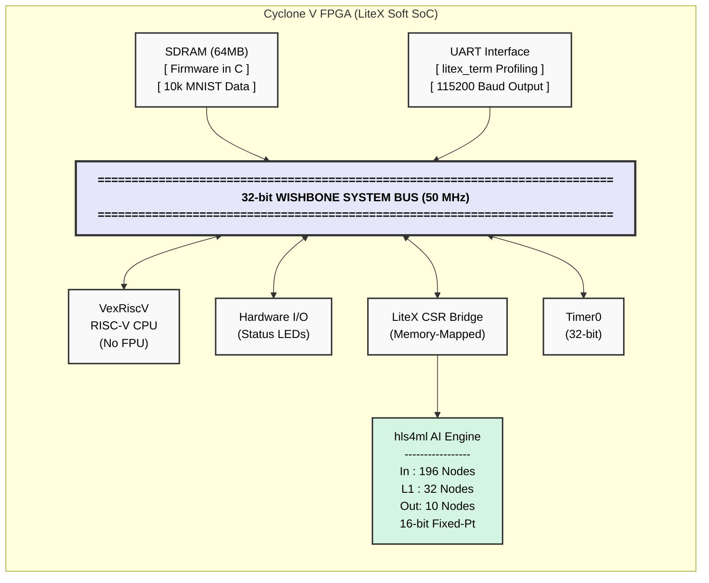

## RISC-V & hls4ml Hardware Neural Network Accelerator

A bare-metal Hardware-Software Co-Design capstone project demonstrating a 78x Architectural Speedup by offloading neural network inference from a soft-core RISC-V processor to a custom FPGA hardware accelerator.
## Project Overview
This project explores the extreme performance differences between general-purpose sequential software execution and spatially unrolled parallel hardware computing.

An entire System-on-Chip (SoC) was generated from scratch and synthesized onto a Terasic DE1-SoC (Intel Cyclone V) FPGA. The system features a 50MHz VexRiscV soft-core CPU orchestrating a custom-built Neural Network engine synthesized via hls4ml. By utilizing a memory-mapped 32-bit Wishbone CSR bridge, the host CPU completely offloads the mathematical workload of an MNIST digit classifier to dedicated FPGA DSP blocks.
Key Achievements

    100% Bare-Metal: Zero reliance on Linux or heavy operating systems. All firmware is written in pure C.

    Flawless Silicon Execution: Achieved 94% accuracy on a 10,000-image dataset running natively on the Cyclone V fabric.

    Massive Throughput: Accelerated inference from 116 FPS (CPU only) to over 9,000 FPS (Hardware Accelerator).

## Architecture Overview

The system consists of a highly optimized Python-trained neural network that has been synthesized into generic Verilog Register-Transfer Level (RTL). It operates on a standard memory-mapped Control and Status Register (CSR) interface, making it CPU-agnostic.

### Hardware Neural Network Specs
* **Input Layer:** 14x14 Binary Image (196 pixels)
* **Hidden Layer:** 32 Dense Neurons
* **Output Layer:** 10 Output Classes
* **Precision:** `ap_fixed<16,8>` (16-bit fixed point, 8 fractional bits) for ultra-high dynamic range without saturation.
* **Output Bus:** 320-bit parallel bus (10 classes × 32 bits).
* **ASIC Ready:** Uses perfect routing divisors to map cleanly to standard digital logic cells.

## System Block Diagram


```mermaid
flowchart TD
    subgraph SoC ["Cyclone V FPGA (LiteX Soft SoC)"]
        direction TD
        
        %% Row 1: Memory and I/O
        SDRAM["SDRAM (64MB)<br/>[ Firmware in C ]<br/>[ 10k MNIST Data ]"]
        UART["UART Interface<br/>[ litex_term Profiling ]<br/>[ 115200 Baud Output ]"]
        
        %% Row 2: The Main System Bus
        WB["============================================================================<br/>32-bit WISHBONE SYSTEM BUS (50 MHz)<br/>============================================================================"]
        
        %% Row 3: Control & Bridge Components
        CPU["VexRiscV<br/>RISC-V CPU<br/>(No FPU)"]
        IO["Hardware I/O<br/>(Status LEDs)"]
        CSR["LiteX CSR Bridge<br/>(Memory-Mapped)"]
        TIMER["Timer0<br/>(32-bit)"]
        
        %% Row 4: Custom Hardware Accelerator
        HLS["hls4ml AI Engine<br/>-----------------<br/>In : 196 Nodes<br/>L1 :  32 Nodes<br/>Out:  10 Nodes<br/>16-bit Fixed-Pt"]
        
        %% Layout Connections
        SDRAM --> WB
        UART --> WB
        
        WB <--> CPU
        WB <--> IO
        WB <--> CSR
        WB <--> TIMER
        
        CSR --> HLS
    end

    %% Styling to keep it looking like a clean architectural diagram
    classDef default fill:#f9f9f9,stroke:#333,stroke-width:2px,color:#000;
    classDef bus fill:#e6e6fa,stroke:#333,stroke-width:3px,color:#000,font-weight:bold;
    classDef custom fill:#d5f5e3,stroke:#333,stroke-width:2px,color:#000;
    
    class WB bus;
    class HLS custom;
```

## The Hardware Handshake

Because the AI accelerator computes at extreme FPGA hardware speeds, it uses an Avalon-style stall handshake to securely pass data back to the slower software CPU without race conditions.

    Load: CPU writes the 14x14 image to the AI's input CSRs.

    Stall & Start: CPU asserts the stall wire and pulses start.

    Compute: The AI core processes the image in pure hardware.

    Hold: Once finished, the AI asserts done. Because stall is active, the hardware holds the done signal HIGH indefinitely.

    Read: CPU detects done, reads the 320-bit output CSRs, and calculates the highest logit.

    Release: CPU drops the stall wire, resetting the hardware for the next image.


Quick Start (FPGA Demo)

1. Generate the Hardware IP:
Run the Makefile synthesis script to generate the generic Verilog files.
    ```bash
    Make
    ```

2. Build the SoC (LiteX):
Navigate to gateware/ and use LiteX to stitch the AI IP to a softcore CPU and synthesize the bitstream (.sof).
    ```bash
    python3 soc.py --build --load
    ```
3. Run the Firmware:
Navigate to firmware/ and compile the bare-metal C code. Ensure your board is connected via UART to view the inference results!
    ```bash
    cd firmware
    make
    ```
4. View the FPGA
Run this command to view the boot-up sequence.
    ```bash
    litex_term --kernel firmware/firmware.bin --kernel-adr 0x40000000 --safe /dev/ttyUSB0
    ```
5. Program the FPGA board with the .sof file
    ```bash
    quartus_pgm -c 1 -m JTAG -o "p;build/gateware/terasic_de1soc.sof@2"
    ```

## Performance Metrics & Benchmarks

To validate the efficiency of the custom Verilog, the exact same neural network architecture (6,592 MACs per image) was profiled in two separate methodologies utilizing a hardware cycle-timer (Timer0):

    Software Baseline: Emulated strictly in C arrays on the VexRiscV CPU.

    Hardware Accelerator: Offloaded via the Wishbone bus to the hls4ml IP.

<table>
  <thead>
    <tr>
      <th align="left">Metric</th>
      <th align="left">Software Baseline (VexRiscV CPU)</th>
      <th align="left">Hardware Accelerator (<code>hls4ml</code> IP)</th>
      <th align="left">The Difference</th>
    </tr>
  </thead>
  <tbody>
    <tr>
      <td align="left"><strong>Throughput (FPS)</strong></td>
      <td align="left">116 Frames/sec</td>
      <td align="left"><strong>9,062 Frames/sec</strong></td>
      <td align="left"><strong>78x Faster</strong></td>
    </tr>
    <tr>
      <td align="left"><strong>Latency per Image</strong></td>
      <td align="left">8,589 &mu;s</td>
      <td align="left"><strong>110 &mu;s</strong></td>
      <td align="left">Saved 8,479 &mu;s per image</td>
    </tr>
    <tr>
      <td align="left"><strong>CPU Cycles per Image</strong></td>
      <td align="left">429,496 cycles</td>
      <td align="left"><strong>5,517 cycles</strong></td>
      <td align="left"><strong>98.7% Reduction in CPU load</strong></td>
    </tr>
    <tr>
      <td align="left"><strong>Compute Performance</strong></td>
      <td align="left">1.52 MOPS</td>
      <td align="left"><strong>119.47 MOPS</strong></td>
      <td align="left">Massive spatial parallelism</td>
    </tr>
  </tbody>
</table>


## References & Acknowledgments

This project bridges the gap between machine learning and bare-metal hardware by leveraging several incredible open-source tools and frameworks. If you are exploring this repository, I highly recommend checking out the documentation for the following projects:

* **[hls4ml](https://fastmachinelearning.org/hls4ml/)**: A Python package for machine learning inference in FPGAs. Used to translate the TensorFlow/Keras neural network into optimized, generic Verilog RTL.
* **[LiteX](https://github.com/enjoy-digital/litex)**: A highly flexible framework for creating FPGA SoCs. Used to synthesize the gateware, generate the CSR bus, and stitch the AI accelerator to the softcore CPU.
* **[VexRiscv](https://github.com/SpinalHDL/VexRiscv)**: A 32-bit RISC-V CPU architecture optimized for FPGAs. Acts as the host processor driving the Avalon handshake and embedded C firmware.
* **[TensorFlow & Keras](https://www.tensorflow.org/)**: The machine learning backend used to train the 16-bit, 32-neuron network.
* **[The MNIST Database](http://yann.lecun.com/exdb/mnist/)**: The classic dataset of handwritten digits used to train and validate the hardware accelerator.