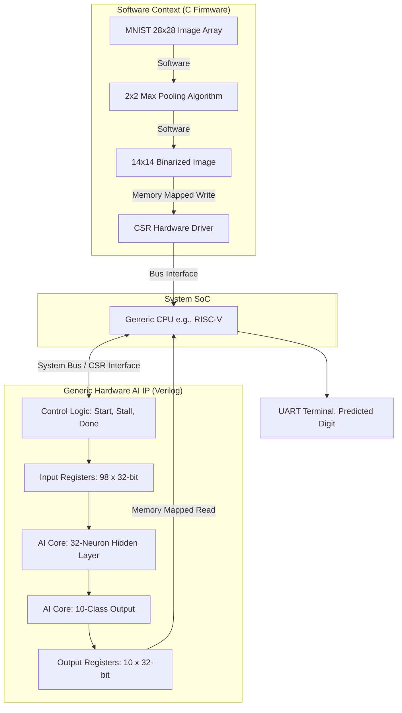

# Generic TinyML Hardware Accelerator

An end-to-end, bare-metal hardware AI accelerator for MNIST digit classification. This project provides a generic, standalone Neural Network IP block generated via `hls4ml`, designed to easily bridge to any system bus or microcontroller. The current demonstration integrates this AI core with a RISC-V softcore on an Intel Cyclone V FPGA using LiteX.

Rather than relying on shallow optimization tricks like Hardware-Aware Quantization (HAQ), this accelerator achieves a minimal footprint through strict architectural scaling, pure digital logic, and perfect reuse-factor divisors to prevent DSP routing failures.

## Architecture Overview

The system consists of a highly optimized Python-trained neural network that has been synthesized into generic Verilog Register-Transfer Level (RTL). It operates on a standard memory-mapped Control and Status Register (CSR) interface, making it CPU-agnostic.

### Hardware Neural Network Specs
* **Input Layer:** 14x14 Binary Image (196 pixels)
* **Hidden Layer:** 32 Dense Neurons
* **Output Layer:** 10 Output Classes
* **Precision:** `ap_fixed<16,8>` (16-bit fixed point, 8 fractional bits) for ultra-high dynamic range without saturation.
* **Output Bus:** 320-bit parallel bus (10 classes × 32 bits).
* **ASIC Ready:** Uses perfect routing divisors to map cleanly to standard digital logic cells.

## System Block Diagram

## The Hardware Handshake

Because the AI accelerator computes at extreme FPGA hardware speeds, it uses an Avalon-style stall handshake to securely pass data back to the slower software CPU without race conditions.

    Load: CPU writes the 14x14 image to the AI's input CSRs.

    Stall & Start: CPU asserts the stall wire and pulses start.

    Compute: The AI core processes the image in pure hardware.

    Hold: Once finished, the AI asserts done. Because stall is active, the hardware holds the done signal HIGH indefinitely.

    Read: CPU detects done, reads the 320-bit output CSRs, and calculates the highest logit.

    Release: CPU drops the stall wire, resetting the hardware for the next image.

Quick Start (FPGA Demo)

1. Generate the Hardware IP:
Run the Makefile synthesis script to generate the generic Verilog files.
Bash

Make

2. Build the SoC (LiteX):
Navigate to gateware/ and use LiteX to stitch the AI IP to a softcore CPU and synthesize the bitstream (.sof).
Bash

python3 soc.py --build --load

3. Run the Firmware:
Navigate to firmware/ and compile the bare-metal C code. Ensure your board is connected via UART to view the inference results!
Bash

make
make load

## References & Acknowledgments

This project bridges the gap between machine learning and bare-metal hardware by leveraging several incredible open-source tools and frameworks. If you are exploring this repository, I highly recommend checking out the documentation for the following projects:

* **[hls4ml](https://fastmachinelearning.org/hls4ml/)**: A Python package for machine learning inference in FPGAs. Used to translate the TensorFlow/Keras neural network into optimized, generic Verilog RTL.
* **[LiteX](https://github.com/enjoy-digital/litex)**: A highly flexible framework for creating FPGA SoCs. Used to synthesize the gateware, generate the CSR bus, and stitch the AI accelerator to the softcore CPU.
* **[VexRiscv](https://github.com/SpinalHDL/VexRiscv)**: A 32-bit RISC-V CPU architecture optimized for FPGAs. Acts as the host processor driving the Avalon handshake and embedded C firmware.
* **[TensorFlow & Keras](https://www.tensorflow.org/)**: The machine learning backend used to train the 16-bit, 32-neuron network.
* **[The MNIST Database](http://yann.lecun.com/exdb/mnist/)**: The classic dataset of handwritten digits used to train and validate the hardware accelerator.